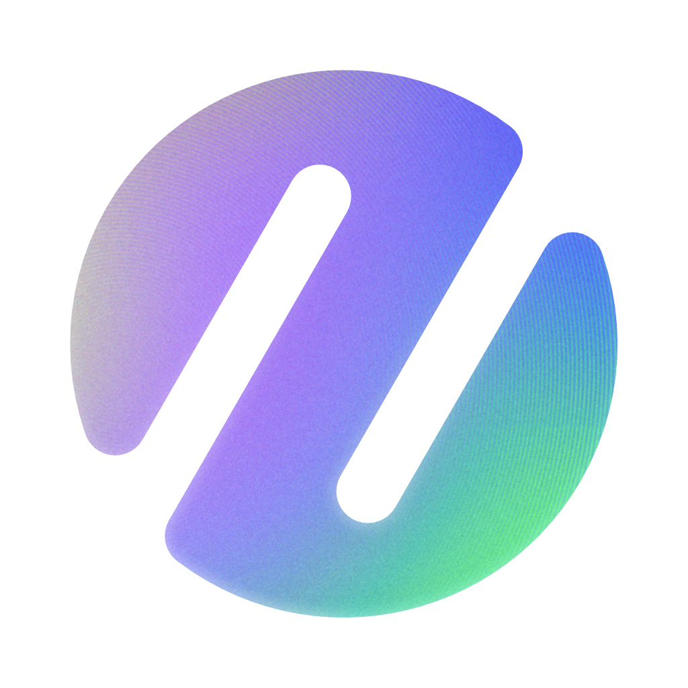

  <strong>English</strong> · <a href="README.es-ES.md">Español (España)</a>

  

<h1 align="center">Zencode</h1>

<strong>Turn conversations into working software.</strong>

Zencode is a desktop workspace for building software with AI coding agents. It keeps the conversation, project context, terminal activity, file changes, Git workflow, permissions, and verification in one place so you can move from an idea to a reviewed change without losing sight of what the agent is doing.

## Public beta

Zencode is currently in public beta. Preview releases may contain defects, change between versions, or require migration as the product develops. Back up important work and review agent-produced changes before committing, pushing, or publishing them.

The newest supported build is available from the [Releases](https://github.com/zencode-chat/zencode/releases) page. During the beta, releases are labeled **Pre-release**.

## What you can do with Zencode

- Open a project and work with agents in project-aware threads.
- Attach relevant files and add repository context to a request.
- Use managed OpenAI Codex and Claude Agent integrations.
- Connect Anthropic, OpenAI, and Z.ai using your own API credentials.
- Follow terminal commands, tool activity, permissions, and runtime events.
- Review diffs and manage staging, commits, remotes, pushes, and pull requests.
- Run recurring work through project-scoped automations.
- Connect curated or custom MCP servers for additional tools.
- Dictate prompts with on-device speech transcription.

Providers and models have different capabilities. Attachment support, tools, context limits, reasoning controls, pricing, and network behavior depend on the provider and model you select.

## Your workspace and connected services

Zencode keeps its workspace state, project access, conversation database, Git operations, terminal sessions, permissions, and speech transcription on your computer. Speech recordings are temporary processing files and are not stored as conversation attachments.

Zencode does not run the selected AI models locally. Prompts and submitted context are sent to the remote provider you choose. Managed agents, model providers, MCP servers, Git hosts, and other integrations can access the network when you enable or invoke them and remain subject to their own terms and privacy practices.

## Downloads

Official releases are currently produced for:

- macOS on Apple silicon;
- macOS on Intel;
- Windows on x64; and
- Linux on x64 as an AppImage.

Download Zencode only from the [official Releases page](https://github.com/zencode-chat/zencode/releases). This public repository is the distribution and update channel for Zencode; it does not contain the private application source code.

### Verify a download

Every release includes a `SHA256SUMS.txt` integrity manifest. Compare the checksum of your download with its corresponding entry before installation.

- macOS releases are Developer ID signed, hardened, and notarized by Apple. Do not bypass Gatekeeper if macOS cannot validate the application.
- Windows releases are digitally signed. Check the installer's **Digital Signatures** properties before running it.
- Linux users should verify the AppImage checksum before making it executable.

If a signature, checksum, filename, or release page looks unexpected, do not install the file. Report the issue privately through [GitHub's security advisory form](https://github.com/zencode-chat/zencode/security/advisories/new).

## Updates

Zencode uses signed release packages and update metadata published in this repository. Beta installations receive compatible beta updates as they become available. Installer packages, update metadata, blockmaps, checksums, tags, and release records remain independently visible on each release page.

## Security

Please do not disclose suspected vulnerabilities, compromised downloads, exposed credentials, or signing problems in a public issue. Follow the private reporting instructions in [SECURITY.md](SECURITY.md).

## License

Zencode is proprietary software and is licensed, not sold. Downloading a release grants only the end-user rights stated in the [Zencode Proprietary Software License Agreement](LICENSE). It does not grant permission to redistribute, modify, repackage, reverse engineer, or create derivative products from Zencode.

Third-party components and services remain governed by their respective licenses and terms.

Copyright © 2026 Zencode. All rights reserved.
